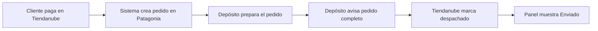

# Reporte de funcionalidades — Backend Unibrandco

**Sistema:** conexión entre la tienda online (Tiendanube), el depósito/logística (Patagonia / DigipWMS) y un panel de administración.

---

## ¿Qué hace este sistema en una frase?

Mantiene el **stock de la tienda alineado con el depósito**, y cuando un cliente **paga un pedido**, lo **envía automáticamente al depósito** para prepararlo; cuando el depósito **termina el pedido**, la tienda lo marca como **enviado/despachado**.

---

## Sistemas con los que trabaja

| Sistema | Rol en el negocio |
|--------|-------------------|
| **Patagonia WMS (DigipWMS)** | Depósito: stock real y pedidos de preparación |
| **Tiendanube** | Tienda online: stock visible y pedidos de clientes |
| **Panel de administración** | Consultas para el equipo (solo usuarios autorizados) |

---

## 1. Sincronización de stock (depósito → tienda)

### Qué hace

- Consulta periódicamente cuántas unidades hay disponibles de cada artículo en Patagonia.
- Guarda una “foto” del stock en cada consulta.
- Compara la foto nueva con la anterior y detecta **cambios** (más/menos unidades, artículos nuevos o que dejaron de existir).
- Si hubo cambios, **actualiza el stock en Tiendanube** para los productos que coinciden por código (SKU).

### Cuándo corre solo

- **Lunes a viernes**, de **06:30 a 19:30** (hora Argentina), aproximadamente **cada 30 minutos**.

### Acción manual (administradores)

- Un administrador puede forzar una sincronización inmediata desde el panel (misma lógica que la automática).

### Limpieza de datos antiguos

- Cada día se borran fotos de stock del depósito con **más de 8 días** de antigüedad (solo esas fotos; no afecta otros archivos como el catálogo de productos).

---

## 2. Pedidos: cuando el cliente paga (tienda → depósito)

### Qué hace

1. Tiendanube avisa que un pedido fue **pagado**.
2. El sistema obtiene el detalle del pedido (productos, cantidades, datos del cliente).
3. Crea un **pedido en Patagonia/DigipWMS** con:
   - Código único ligado al pedido de Tiendanube (ej. `1983713089TN`)
   - Productos y cantidades
   - Observaciones con datos del comprador (hasta 280 caracteres)
   - Estado inicial: **Pendiente**
4. Si la creación en el depósito fue exitosa, **guarda el registro** para consultarlo después en el panel.

### Qué no hace

- Otros eventos de Tiendanube (que no sean “pedido pagado”) se ignoran sin crear pedido en depósito.
- Si falla el envío al depósito, **no queda guardado** como pedido exitoso.

---

## 3. Pedidos: cuando el depósito termina (depósito → tienda)

### Qué hace

1. DigipWMS avisa que el pedido está **completo** (`Pedido_Completo`).
2. El sistema identifica el pedido de Tiendanube a partir del código del depósito.
3. Marca el envío en Tiendanube como **despachado** (`DISPATCHED`).
4. Actualiza el registro interno: el pedido pasa a estado **enviado** (`shipped`) con fecha de despacho.

### Estados visibles para el equipo

| Estado | Significado |
|--------|-------------|
| **Pendiente** | Pedido creado en depósito; aún no confirmado el despacho en tienda |
| **Enviado** | Depósito completó el pedido y la tienda quedó marcada como despachada |

---

## 4. Panel de administración (solo equipo autorizado)

Acceso con **usuario y contraseña** (sistema de login Cognito); solo perfiles del grupo **ADMIN**.

### Funciones disponibles

| Área | Qué permite ver o hacer |
|------|-------------------------|
| **Resumen (dashboard)** | Última actualización de stock hacia Tiendanube: cuántos productos se actualizaron y cuáles |
| **Sincronización manual** | Disparar una consulta de stock al depósito ahora |
| **Historial de cambios de stock** | Lista de sincronizaciones con cantidad de artículos modificados; detalle producto por producto |
| **Archivos de stock del depósito** | Listar y descargar las “fotos” de stock de un día determinado |
| **Pedidos enviados al depósito** | Lista paginada de pedidos creados desde Tiendanube (más recientes primero) |
| **Detalle de un pedido** | Ver pedido completo: lo que vino de la tienda y lo que se mandó al depósito |

---

## 5. Flujo completo de un pedido (vista de negocio)

En paralelo, el stock de la tienda se va actualizando solo según lo que reporta el depósito.

---

## 6. Seguridad y limitaciones importantes

- **Panel y sincronización manual:** protegidos; hace falta iniciar sesión como administrador.
- **Aviso de “pedido pagado” desde Tiendanube:** hoy la URL del aviso es pública (cualquiera que la conozca podría disparar el proceso). Se recomienda no compartirla y planear refuerzo de seguridad.
- **Credenciales** (claves de Patagonia y Tiendanube) se guardan de forma segura en AWS Secrets Manager, no en el código.

---

## 7. Qué necesita el negocio para que todo funcione

1. **Clave de API de Patagonia** configurada después del despliegue.
2. **Credenciales de Tiendanube** (tienda, token con permisos de pedidos y envíos).
3. **Webhooks registrados** en Tiendanube (“pedido pagado”) y en DigipWMS (“pedido completo”).
4. **Catálogo de productos** en la nube: archivo que relaciona códigos del depósito con productos de Tiendanube (se sube cuando cambia el catálogo).
5. **Usuarios administradores** creados en el sistema de login.

---

## Resumen ejecutivo

| Proceso | Automático | Beneficio |
|---------|------------|-----------|
| Stock depósito → tienda | Sí (horario laboral L–V) | La web no vende de más ni de menos vs. depósito |
| Pedido pagado → depósito | Sí | Menos carga manual al cargar pedidos |
| Pedido listo → tienda “despachado” | Sí | Cliente y operaciones ven estado coherente |
| Consultas y reportes | Panel admin | Transparencia y auditoría sin entrar a cada sistema |
